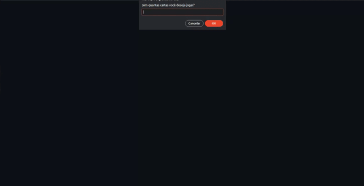

# Parrot Cards

<p align="center">
   
</p>


- Um jogo que trabalha a memória visual, atenção e concentração
- Escolha um número par entre 4 e 14 para jogar
- Feito com JavaScript vanilla, este é um excelente projeto para praticar lógica de programação
- [Veja meu deploy na github pages aqui](https://marcojr73.github.io/projeto4-parrotscardgame/)

***

# Demonstração

<p align="center">
   
</p>

## Como usar

Instale meu projeto e abra-o no navegador

```bash
  git clone git@github.com:marcojr73/projeto4-parrotscardgame.git
```

***

##	 Tecnologias e Conceitos

- HTML
- CSS
- JavaScript

***
    
